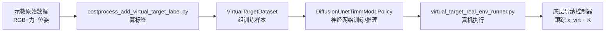

# ACP 核心代码导读：按数据流走一遍

> 读法：按数据怎么流来读，不按文件目录硬记。  
> 官方代码路径前缀：`adaptive_compliance_policy/`

---

## 总览：一条数据流



**完整链路（含清洗）：**

```
人类示教采集
    ↓
raw episode（RGB + wrench + pose + timestamp）
    ↓
real_data_processing.py          ← 清洗、滤波、时间对齐、转 zarr
    ↓
postprocess_add_virtual_target_label.py  ← 算虚拟目标 + 刚度标签
    ↓
VirtualTargetDataset             ← 组训练样本（滑窗切片）
    ↓
DiffusionUnetTimmMod1Policy      ← 多模态编码 + 扩散模型训练
    ↓
virtual_target_real_env_runner.py ← 真机推理 + 刚度矩阵重建 + 执行
```

**当前 Demo 对应 B 层**（`VirtualTargetEstimator`），还没走到 D、E。先把控制原理搞懂，再上神经网络。

---

## 第 0 层：训练入口 `train.py`

**文件：** `PyriteML/train.py`

```python
@hydra.main(
    version_base=None,
    config_path=str(pathlib.Path(__file__).parent.joinpath(
        'diffusion_policy','config'))
)
def main(cfg: OmegaConf):
    OmegaConf.resolve(cfg)
    cls = hydra.utils.get_class(cfg._target_)
    workspace: BaseWorkspace = cls(cfg)
    workspace.run()
```

**人话解释：**
- 这个文件本身几乎不写算法，只是“启动器”
- `hydra` 读 YAML 配置（`train_spec_workspace.yaml`）
- 根据配置创建 `workspace`，然后 `workspace.run()` 开始训练

**要记住：**
> 真正训练逻辑不在 `train.py`，而在 `workspace` → `policy` → `dataset` 里。

---

## 第 1 层：标签生成（Demo 核心）

### 文件
- `PyriteUtility/planning_control/compliance_helpers.py`
- `PyriteEnvSuites/scripts/postprocess_add_virtual_target_label.py`

### 核心类：`VirtualTargetEstimator.update()`

```python
f = -wrench_T[: self.dim]
...
f_norm = np.linalg.norm(f_reg)
if f_norm < self.f_low:
    k = self.k_max
    twist_reg_TC = np.zeros(self.dim)
elif f_norm > self.f_high:
    k = self.k_min
    twist_reg_TC = f_reg / k
else:
    k = self.k_max - (self.k_max - self.k_min) * (f_norm - self.f_low) / (
        self.f_high - self.f_low
    )
    twist_reg_TC = f_reg / k
```

**逐行理解：**

| 代码 | 含义 |
|------|------|
| `f = -wrench_T[:3]` | 取工具坐标系力，取负号（力传感器方向约定） |
| `f_norm < f_low` | 几乎没接触 → 高刚度 `k_max`，虚拟目标偏移为 0 |
| `f_norm > f_high` | 强接触 → 低刚度 `k_min`，偏移 = `f/k` |
| 中间区间 | 刚度线性插值，平滑过渡 |

**输出：**
- `k`：当前刚度幅值（标量）
- `pos_TC`：工具坐标系下虚拟目标相对参考的偏移
- 最终：`x_virt = x_ref + offset`

### 后处理脚本怎么用它

```python
for t in range(num_robot_time_steps):
    ...
    k, pos_TC, flag_adjusted = pe.update(wrench_T, twist_diff)
    SE3_TC = SE3.Rt(np.eye(3), pos_TC)
    SE3_WC = SE3_WT * SE3_TC
    ts_pose_virtual_target[t] = np.concatenate([SE3_WC.t, r2q(SE3_WC.R)])
    stiffness[t] = k
```

**这就是 Demo 里做的事**：对每个时间步，根据力算虚拟目标和刚度，写回数据集。

---

## 第 2 层：数据格式转换（19 维动作从哪来）

### 文件
`PyriteConfig/tasks/common/common_type_conversions.py`

### 关键函数：`raw_to_action19()`

```python
for id in id_list:
    ts_pose9_command = su.SE3_to_pose9(su.pose7_to_SE3(ts_pose7_command))
    ts_pose9_virtual_target = su.SE3_to_pose9(
        su.pose7_to_SE3(ts_pose7_virtual_target)
    )
    stiffness = raw_data[f"stiffness_{id}"][:][:, np.newaxis]
    action.append(
        np.concatenate(
            [ts_pose9_command, ts_pose9_virtual_target, stiffness], axis=-1
        )
    )
episode_data["action"] = np.concatenate(action, axis=-1)
```

**19 维动作 = 9 + 9 + 1：**

```
[参考位姿 9D] + [虚拟目标 9D] + [刚度 k_low 1D] = 19D
```

**观测 `raw_to_obs()` 组装：**
- `rgb_0`：图像
- `robot0_eef_pos`：末端位置 3D
- `robot0_eef_rot_axis_angle`：旋转 6D
- `robot0_eef_wrench`：六维力 6D

这就是多模态输入的来源。

---

## 第 3 层：数据集加载

### 文件
`PyriteML/diffusion_policy/dataset/virtual_target_dataset.py`

**它做什么：**
1. 从 zarr 读原始 episode
2. 调 `raw_to_obs()` / `raw_to_action19()` 转换格式
3. 用 `SequenceSampler` 切时间窗口（如力窗口 7000 点、动作 horizon 16 步）
4. 每次 `__getitem__` 返回一个训练样本：`{obs, action}`

**你要理解：**
> 神经网络看到的不是整条轨迹，而是“一小段窗口”的 `(观测片段, 动作片段)` 对。

**时间对齐（`sampler.py`）：**
- 以 action 时间戳为 query 锚点
- 各模态按各自 `down_sample_steps` 和 `horizon` 回查历史窗口
- RGB、位姿、力窗口长度不同，但在同一 action 时刻对齐

---

## 第 4 层：神经网络策略（ACP 本体）

### 文件
- `diffusion_unet_timm_mod1_policy.py`：策略主类
- `timm_obs_encoder_with_force_spec.py`：多模态编码器
- `force_spec_encoder.py`：FFT 力编码

### 4.1 编码器：把多模态变成特征向量

```
RGB 图像 ──→ ViT 编码 ──┐
力时序   ──→ FFT→ResNet18 ──┼──→ Transformer 交叉注意力 ──→ global_cond
位姿历史 ──→ 低维编码 ──┘
```

### 4.2 策略网络：`predict_action()` 推理流程

```python
def predict_action(self, obs: Dict) -> Dict[str, torch.Tensor]:
  nobs_sparse = self.sparse_normalizer.normalize(obs_dict_sparse)
  sparse_nobs_encode = self.obs_encoder(nobs_sparse)   # ① 编码观测
  ...
  sparse_naction_pred = self.conditional_sample(       # ② 扩散采样
      condition_data=cond_data,
      condition_mask=cond_mask,
      global_cond=sparse_nobs_encode,
  )
  sparse_action_pred = self.sparse_normalizer["action"].unnormalize(...)  # ③ 反归一化
  return {"sparse": sparse_action_pred}  # shape: [batch, horizon, 19]
```

**扩散采样 `conditional_sample()` 在干什么：**

```python
trajectory = torch.randn(...)  # 从随机噪声开始
for t in scheduler.timesteps:
    model_output = model(trajectory, t, global_cond=global_cond)
    trajectory = scheduler.step(model_output, t, trajectory).prev_sample
return trajectory  # 逐步去噪，得到干净的动作轨迹
```

**人话：**
- 先随机生成一团“噪声动作”
- 网络根据观测，一步步把噪声修成合理动作
- 最终输出未来 16 步的 19 维动作序列

### 4.3 训练时 `compute_loss()` 在干什么

- 给真实动作加噪声
- 让网络预测“加了多少噪声”
- 预测越准，loss 越小

> 训练 = 让网络学会从观测预测专家动作。

---

## 第 5 层：真机部署

### 文件
`PyriteEnvSuites/env_runners/virtual_target_real_env_runner.py`

**主循环逻辑：**

```python
obs_raw = env.get_observation_from_buffer()      # ① 读硬件观测
raw_to_obs(obs_raw, obs_task, shape_meta)        # ② 格式转换
controller.set_observation(obs_task["obs"])
(action_sparse_target_mats,
 action_sparse_vt_mats,
 action_stiffnesses) = controller.compute_sparse_control(device)  # ③ 模型推理
# ④ 由 x_ref/x_virt 差重构刚度矩阵 K，下发控制器
```

**推理输出拆包：**
- `action_sparse_target_mats` → 参考位姿 x_ref
- `action_sparse_vt_mats` → 虚拟目标 x_virt
- `action_stiffnesses` → k_low

然后重建 6×6 刚度矩阵，发给底层导纳控制器执行。

---

## 推荐阅读顺序

| 顺序 | 文件 | 重点看什么 | 预计时间 |
|------|------|-----------|----------|
| 1 ✅ | `compliance_helpers.py` → `VirtualTargetEstimator` | `update()` 三段 if | 30min |
| 2 ✅ | `postprocess_add_virtual_target_label.py` | `process_episode()` 循环 | 20min |
| 3 | `common_type_conversions.py` | `raw_to_obs`, `raw_to_action19` | 20min |
| 4 | `virtual_target_dataset.py` | `__init__`, 数据怎么切片 | 30min |
| 5 | `diffusion_unet_timm_mod1_policy.py` | `predict_action`, `conditional_sample` | 40min |
| 6 | `timm_obs_encoder_with_force_spec.py` | `forward()` 多模态融合 | 30min |
| 7 | `virtual_target_real_env_runner.py` | 主循环 + 刚度重建 | 30min |

---

## 和 i7 的关系（对照表）

| ACP 官方模块 | i7 现状 | 差距 |
|-------------|---------|------|
| `ManipServerEnv.get_observation` | ring buffer 读 wrench/pose | 缺 RGB |
| `raw_to_obs()` | 需自己写组包 | 缺视觉字段 |
| `load_policy()` + `predict_action()` | 无 | 需加推理服务 |
| 刚度矩阵重建 + 下发 | `force_joint_admittance` | 需桥接层 |

---

## 配套文档

- `docs/ACP_ALGORITHM_GUIDE.zh.md`：算法原理说明
- `docs/HANDOVER.zh.md`：交接总览与主线
- `docs/I7_ACP_ADAPTATION.zh.md`：真机适配与桥接思路
