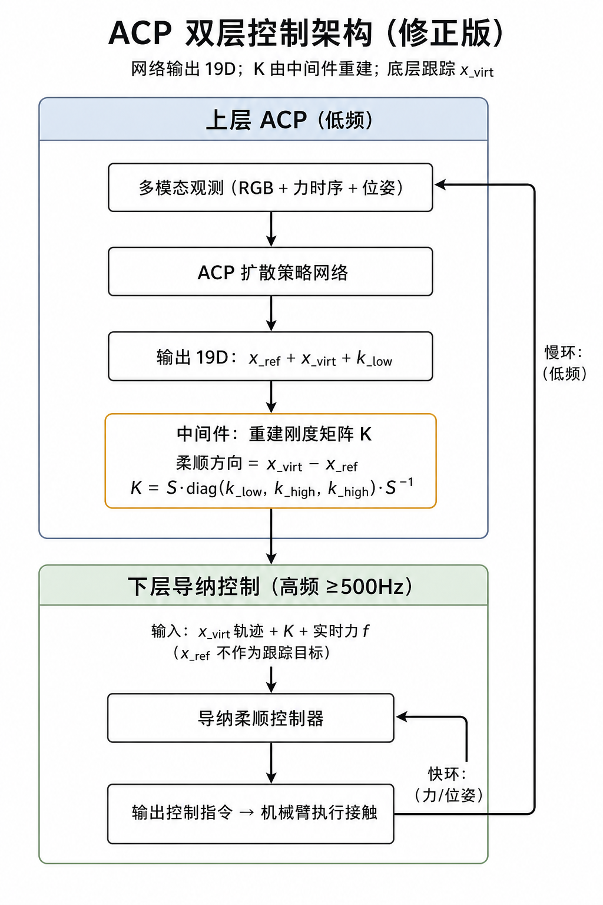
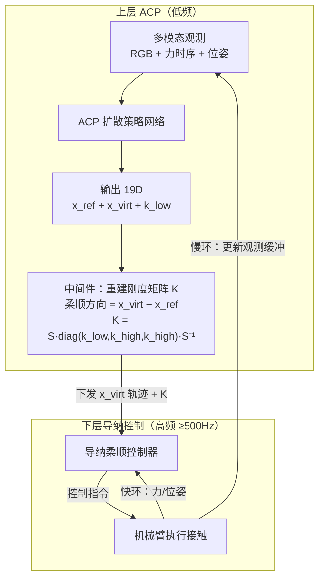

# ACP 论文研读笔记（飞书版）

> 带教要求：4090 到货前，仔细研读 ACP 全文细节——网络结构、数据清洗对齐、训练输入输出、数据强化、信息注入等。  
> 本文档按**代码可定位**的方式整理，可直接复制到飞书。

---

## 0. 工作定位（和带教对齐）

**结论：ACP 值得复现，且我们具备采集环境基础。**

| 带教关注点 | 我们是否具备 | 当前状态 |
|-----------|-------------|---------|
| 论文方法可复现 | ✅ 官方开源代码 + 数据集 | 已克隆代码，Demo 已跑通 |
| 按论文方式采集数据 | ✅ i7 有力传感器 + 位姿控制 | 缺 RGB 同步采集链路 |
| 4090 训练 | ⏸ 等待硬件 | 脚本已备好 |
| 应用到其他富接触任务 | 📋 后续 | 先 flip，再扩展 |

**当前阶段策略（已和带教思路一致）：**
1. 4090 前：吃透论文 + 代码细节，写清飞书笔记
2. 4090 后：公开数据训练 → i7 零样本测试 → 按需采集微调

---

## 1. ACP 整体流水线（必背）

```
人类示教采集
    ↓
raw episode（RGB + wrench + pose + timestamp）
    ↓
real_data_processing.py          ← 清洗、滤波、时间对齐、转 zarr
    ↓
postprocess_add_virtual_target_label.py  ← 算虚拟目标 + 刚度标签
    ↓
VirtualTargetDataset             ← 组训练样本（滑窗切片）
    ↓
DiffusionUnetTimmMod1Policy      ← 多模态编码 + 扩散模型训练
    ↓
virtual_target_real_env_runner.py ← 真机推理 + 刚度矩阵重建 + 执行
```

---

## 2. 数据采集格式（论文 / 官方）

### 2.1 原始 episode 目录结构

```
episode_1727294514/
├── rgb_0/
│   └── img_000695_29345.186724_ms.jpg   # 文件名含帧号+时间戳
├── robot_data_0.json                     # 位姿 + robot_time_stamps
└── wrench_data_0.json                    # 六维力 + wrench_time_stamps
```

### 2.2 我们 i7 需要对齐的字段

| 字段 | 来源 | 频率建议 |
|------|------|---------|
| RGB 图像 | USB 相机 | ~30Hz |
| 六维力 wrench | ExternalWrenchState | ≥500Hz |
| 末端位姿 pose | RightArmState | ≥500Hz |
| 时间戳 | 各传感器统一时钟 | 必须同步 |

**关键：不是只采数据，而是采“能对齐的数据”。**

---

## 3. 数据清洗与对齐（代码级）

### 3.1 第一步：raw → zarr

**文件：** `PyriteUtility/data_pipeline/real_data_processing.py`

| 步骤 | 代码做什么 |
|------|-----------|
| 读 RGB | `cv2.imread`，BGR→RGB，从文件名解析时间戳 |
| 读位姿/力 | 从 `robot_data_*.json`、`wrench_data_*.json` 读取 |
| 力滤波 | `LiveLPFilter(fs=500, cutoff=5, order=5)` 低通滤波 |
| 时间归零 | 取 RGB/robot/wrench 最小时间戳作为 offset，统一减到从 0 开始 |
| 存 zarr | `EpisodeDataBuffer.save_video_for_episode` + `save_low_dim_for_episode` |

### 3.2 第二步：算虚拟目标标签

**文件：** `PyriteEnvSuites/scripts/postprocess_add_virtual_target_label.py`

| 步骤 | 代码做什么 |
|------|-----------|
| 力偏置去除 | 前 200 帧均值作为 offset |
| 力滑动平均 | 窗口 7000 点（约 1 秒） |
| 时间对齐 | `t_wrench = argmin(|wrench_ts - robot_ts[t]|)` 最近邻对齐 |
| 坐标变换 | 仿真数据：传感器坐标系 → 工具坐标系 |
| 标签计算 | `VirtualTargetEstimator.update()` → `x_virt` + `k` |

### 3.3 训练时的时间对齐

**文件：** `PyriteML/diffusion_policy/common/sampler.py`

- 以 action 时间戳为 query 锚点
- 各模态按各自 `down_sample_steps` 和 `horizon` 回查历史窗口
- RGB、位姿、力窗口长度不同，但在同一 action 时刻对齐

**flip_up 任务的对齐参数（`flip_up_spec.yaml`）：**

| 模态 | horizon | down_sample_steps | 实际窗口 |
|------|---------|-------------------|---------|
| RGB | 2 | 10 | 2 帧，间隔 10 步 |
| 位姿 | 3 | 5 | 3 帧，间隔 5 步 |
| 力 | 7000 | 1 | 7000 点连续窗口 |
| 动作 | 16 | 50 | 未来 16 步动作 |

---

## 4. 训练输入输出（最重要）

### 4.1 输入（观测 obs）

| 字段 | shape | 含义 |
|------|-------|------|
| `rgb_0` | [2, 3, 224, 224] | 2 帧 RGB 图像 |
| `robot0_eef_pos` | [3, 3] | 3 帧末端位置 |
| `robot0_eef_rot_axis_angle` | [3, 6] | 3 帧旋转（6D 表示） |
| `robot0_eef_wrench` | [7000, 6] | 7000 点力时序 |

**转换代码：** `PyriteConfig/tasks/common/common_type_conversions.py` → `raw_to_obs()`

### 4.2 输出（动作 action）

**19 维 = 9 + 9 + 1：**

| 字段 | 维度 | 含义 |
|------|------|------|
| `ts_pose9_command` | 9 | 参考位姿 x_ref（旋转矩阵展平） |
| `ts_pose9_virtual_target` | 9 | 虚拟目标 x_virt |
| `stiffness` | 1 | 刚度幅值 k_low |

**拼接代码：** `raw_to_action19()` in `common_type_conversions.py`

### 4.3 训练时在干什么

```
输入 obs → 编码器 → 条件特征 global_cond
随机噪声动作 → 扩散 UNet → 预测噪声
loss = MSE(预测噪声, 真实噪声)
```

**入口：** `train.py` → `train_spec_workspace.yaml` → `DiffusionUnetTimmMod1Policy.compute_loss()`

---

## 5. 网络结构（带教重点）

### 5.1 整体架构

```
┌─────────────────────────────────────────────────┐
│           TimmObsEncoderWithForceSpec            │
│  ┌──────────┐  ┌──────────────┐  ┌───────────┐  │
│  │ ViT-CLIP │  │ FFT→ResNet18 │  │ 位姿低维  │  │
│  │ RGB编码  │  │  力频谱编码   │  │  直接拼接  │  │
│  └────┬─────┘  └──────┬───────┘  └─────┬─────┘  │
│       └───────┬───────┘                │        │
│         Transformer 交叉注意力          │        │
│               ↓                        ↓        │
│         global_cond ────────── + low_dim_feat   │
└───────────────────────┬─────────────────────────┘
                        ↓
┌─────────────────────────────────────────────────┐
│           ConditionalUnet1D（扩散模型）           │
│  输入：噪声动作 [batch, 16, 19]                   │
│  条件：global_cond                               │
│  输出：预测噪声 → 逐步去噪 → 干净动作序列          │
└─────────────────────────────────────────────────┘
```

### 5.2 各编码器细节

| 模块 | 配置 | 文件 |
|------|------|------|
| 视觉 | ViT-Base/32 CLIP, pretrained, attention_pool_2d | `timm_obs_encoder_with_force_spec.py` |
| 力（FFT） | 时序→频谱→ResNet18, 6通道 | `force_spec_encoder.py` |
| 融合 | modality-attention (Transformer) | `fuse_mode: modality-attention` |
| 扩散 | UNet1D, down_dims=[256,512,1024] | `diffusion_unet_timm_mod1_policy.py` |

### 5.3 力 FFT 编码流程（信息注入核心）

**文件：** `force_spec_encoder.py` → `convert_to_spec()`

```
六维力时序 [7000, 6]
    ↓ scipy.signal.spectrogram (nperseg=512, fs=7000)
频谱 [6, 30, 17]  (6通道 × 30频率 × 17时间)
    ↓ log + 归一化到 [-1, 1]
    ↓ CoordConv 加坐标编码
ResNet18 编码 → 力特征向量
```

**为什么用 FFT 而不是时序卷积：**
- FFT 提取摩擦/接触的周期性高频特征
- 结合视觉可提前预判接触
- 论文消融：擦拭任务 FFT 比 TCN 高 12.75%

---

## 6. 数据强化（Data Augmentation）

**配置位置：** `train_spec_workspace.yaml` → `vision_encoder_cfg.transforms`

| 增强方法 | 参数 | 作用 |
|---------|------|------|
| RandomCrop | ratio=0.95 | 随机裁剪 95% 区域 |
| ColorJitter | brightness=0.3, contrast=0.4, saturation=0.5, hue=0.08 | 颜色抖动，增强光照鲁棒性 |

**注意：** 力信号和位姿不做增强，只对 RGB 图像做。

**训练时额外扰动：**
- `input_pertub: 0.1`：给动作加小噪声，防止过拟合
- 扩散过程本身也是一种“噪声增强”

---

## 7. 信息注入（Information Injection）

ACP 的信息注入体现在三个层面：

### 7.1 力信息注入：FFT 频谱编码

- 将时域力信号转为频域频谱
- 保留摩擦、冲击的周期性特征
- 代码：`convert_to_spec()` → `ForceSpecEncoder`

### 7.2 多模态融合：Transformer 自注意力

- RGB 与力特征对齐后拼成同一条 token 序列
- 经 `TransformerEncoderLayer` 做 **Self-Attention**（不是交叉注意力）
- 代码：`fuse_mode: modality-attention`
- 让模型学习“看到什么 + 感受到什么 → 该怎么动”

### 7.3 柔顺信息注入：19 维动作输出

- 普通 DP 只输出 9 维位姿
- ACP 额外输出虚拟目标(9D) + 刚度(1D)
- 把柔顺控制信息直接注入动作空间

---

## 8. 真机部署链路

**文件：** `virtual_target_real_env_runner.py`

### 8.1 双层控制架构（修正版）

> 网络**不直接**输出刚度矩阵 K；底层跟踪的是 **x_virt**，不是 x_ref。





**要点：**
- 上层输出：`x_ref`、`x_virt`、`k_low`（19 维）
- 中间重建：由 `x_virt−x_ref` 得柔顺主轴，再与 `k_low` 拼出 6×6 的 `K`
- 下层输入：`x_virt` + `K` + 实时力 `f`（`x_ref` 不进跟踪）
- 双时间尺度：导纳快环闭环；ACP 慢环重规划

### 8.2 单 horizon 执行步骤

```
每 ~50ms 一个 horizon：
  ① env.get_observation_from_buffer()     读硬件
  ② raw_to_obs()                          格式转换
  ③ policy.predict_action()               模型推理 → 19D
  ④ 拆包：x_ref, x_virt, k_low
  ⑤ 由 x_ref/x_virt 差重构 6×6 刚度矩阵 K
  ⑥ schedule_controls(x_virt, K)         下发给底层导纳
```

---

## 9. 我们 i7 的差距清单

| ACP 需要 | i7 现状 | 改造优先级 |
|---------|---------|-----------|
| RGB 采集 + 时间戳 | ❌ 无 | P0 |
| wrench 高频采集 | ✅ 有 | - |
| 位姿采集 | ✅ 有 | - |
| 时间对齐 | ⚠️ 需实现 | P0 |
| 多模态组包 (raw_to_obs) | ❌ 需写 | P1 |
| 模型推理服务 | ❌ 需写 | P1（4090后） |
| 控制桥接 (x_virt→控制器) | ❌ 需写 | P1 |
| 力导纳兜底 | ✅ 有 | - |

---

## 10. 4090 前工作计划（按带教要求）

### 本周：论文 + 代码细读

- [ ] 精读 `compliance_helpers.py` VirtualTargetEstimator（已完成 Demo 验证）
- [ ] 精读 `common_type_conversions.py` 理解 19 维动作组装
- [ ] 精读 `real_data_processing.py` 理解清洗对齐流程
- [ ] 精读 `timm_obs_encoder_with_force_spec.py` 理解多模态融合
- [ ] 精读 `force_spec_encoder.py` 理解 FFT 力编码
- [ ] 对照 `flip_up_spec.yaml` 理解所有超参数含义

### 下周：i7 采集链路设计

- [ ] 设计 i7 episode 数据格式（对齐官方结构）
- [ ] 确定 RGB 相机选型和安装位置
- [ ] 写时间同步方案（ring buffer 时间戳对齐）
- [ ] 写最小采集脚本 prototype

### 4090 到货后

- [ ] 公开数据训练首版模型
- [ ] i7 零样本测试
- [ ] 根据效果决定是否 i7 采集微调

---

## 11. 关键代码文件速查

| 关注点 | 文件路径 |
|--------|---------|
| 训练入口 | `PyriteML/train.py` |
| 训练配置 | `PyriteML/diffusion_policy/config/train_spec_workspace.yaml` |
| 任务配置 | `PyriteML/diffusion_policy/config/task/flip_up_spec.yaml` |
| 数据清洗 | `PyriteUtility/data_pipeline/real_data_processing.py` |
| 标签生成 | `PyriteEnvSuites/scripts/postprocess_add_virtual_target_label.py` |
| 核心算法 | `PyriteUtility/planning_control/compliance_helpers.py` |
| 格式转换 | `PyriteConfig/tasks/common/common_type_conversions.py` |
| 数据集 | `PyriteML/diffusion_policy/dataset/virtual_target_dataset.py` |
| 采样对齐 | `PyriteML/diffusion_policy/common/sampler.py` |
| 策略网络 | `PyriteML/diffusion_policy/policy/diffusion_unet_timm_mod1_policy.py` |
| 多模态编码 | `PyriteML/diffusion_policy/model/vision/timm_obs_encoder_with_force_spec.py` |
| FFT 力编码 | `PyriteML/diffusion_policy/model/vision/force_spec_encoder.py` |
| 真机部署 | `PyriteEnvSuites/env_runners/virtual_target_real_env_runner.py` |

---

## 12. 飞书汇报一句话

> 4090 到货前，我已完成 ACP 核心算法 Demo 验证和多模态代码细读，梳理了从数据采集→清洗对齐→标签生成→网络训练→真机部署的完整链路，并明确了 i7 需补齐 RGB 采集和多模态组包两项工程工作。4090 到位后先公开数据训练，再 i7 实测决定是否采集微调。
