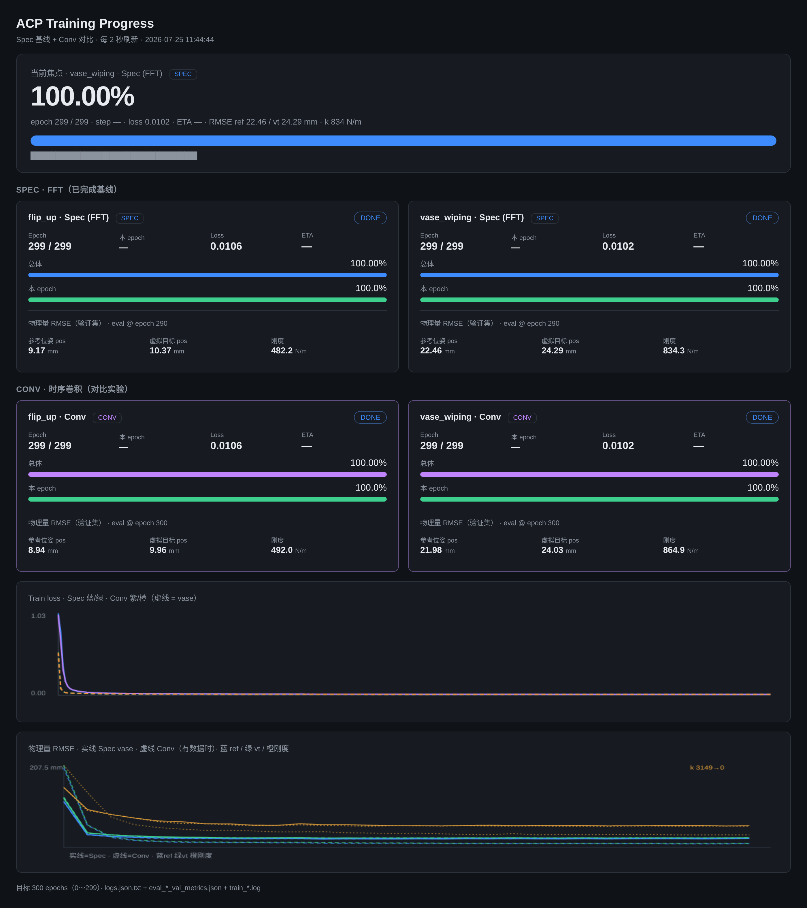

# Spec（频域 FFT）训练结果归档

> 归档日期：2026-07-22  
> 编码方式：**ACP Spec / FFT 力频谱**（论文主方法）  
> 目的：长时间后仍能分清「单臂 / 双臂各训了什么、权重在哪、数字怎么读」

相关对比实验（Conv）见同目录：[`TRAINING_CONV_COMPARE.zh.md`](TRAINING_CONV_COMPARE.zh.md)

---

## 0. 摘要对照表

| 项目 | 单臂 Flip-up | 双臂 Vase wiping |
|------|--------------|------------------|
| 任务 | 物品翻转（1 臂） | 花瓶擦拭（2 臂） |
| 力编码 | **Spec / FFT** | **Spec / FFT** |
| 配置入口 | `train_spec_workspace` + `flip_up_spec` | `train_spec_workspace` + `vase_wiping_spec` |
| 数据集 | `~/data/real_processed/flip_up_new_v5` | `~/data/real_processed/vase_wiping_v6.3` |
| 计划轮数 | 300（epoch **0～299**） | 同左 |
| 规范运行目录 | `~/training_outputs/2026.07.17_14.42.42_flip_up_new_resnet_230` | `~/training_outputs/2026.07.18_10.23.05_vase_wiping_resnet_230` |
| 部署权重 | `…/checkpoints/latest.ckpt` | 同左 |
| `latest.ckpt` 内 epoch 字段 | **290** | **290** |
| 原因 | `checkpoint_every=10`，范围内最后一次存盘是 290；299 结束未再存 | 同左 |
| 终盘 train_loss（epoch 299） | ≈ **0.0106** | ≈ **0.0102** |
| 物理 RMSE（验证） | **有**（补跑 @ epoch 290，见下） | **有**（eval@290） |
| batch_size | 128 | **32**（显存；Hydra override） |

**结论（Spec 基线）**：两边都已按论文 **300 epoch** 跑完；部署用各自 `latest.ckpt`（权重对应约 epoch 290 存盘点）即可，不必再训到「文件名写成 299」。

### 终盘进度面板截图



本机面板：http://127.0.0.1:8765/（`bash scripts/run_progress_panel.sh`）。上图为 Spec + Conv 四条正式 run 全部完成后的终盘页面（2026-07-25）：四卡均为 DONE 100%、epoch 299，下方为 train loss 与物理量 RMSE 曲线。

---

## 1. Spec 是什么（和 Conv 差在哪）

| | Spec（本归档） | Conv（对比用） |
|--|----------------|----------------|
| 力编码器 | `TimmObsEncoderWithForceSpec` + `vit-force` | `TimmObsEncoderWithForce` + `causalconv` |
| 力序列 | 约 **7000** 点高频 wrench → FFT | **32** 帧时序卷积 |
| `normalize_wrench` | false（Spec 跑次） | true（官方 conv task） |
| 论文角色 | **主方法 ACP** | 消融 **ACP w/o FFT** |

官方启动方式（勿改原 yaml 做实验时，用 compare 副本，见 Conv 文档）：

```bash
# Spec（已完成）
accelerate launch train.py --config-name=train_spec_workspace task=flip_up_spec
accelerate launch train.py --config-name=train_spec_workspace task=vase_wiping_spec
```

---

## 2. 目录分层（结果去哪找）

```
~/training_outputs/<run_dir>/
├── checkpoints/
│   ├── latest.ckpt                          # 部署默认
│   └── epoch=XXXX-train_loss=….ckpt         # top-k / 每 10 epoch
├── logs.json.txt                            # 逐步 / 每 epoch loss
├── eval_latest_val_metrics.json             # 最新物理 RMSE（若有）
├── eval_epoch_XXXX_val_metrics.json         # 各 checkpoint 的 RMSE
├── .hydra/config.yaml                       # 当时完整配置快照
└── .hydra/overrides.yaml                    # 命令行覆盖项

终端日志（本机）：
  ~/ACP-repo/logs/train_flip_up.log
  ~/ACP-repo/logs/train_vase_wiping.log

可视化面板：
  http://127.0.0.1:8765/   # scripts/train_progress_server.py
  终盘截图：docs/figures/train_progress_panel_final.png
```

本仓库内快照副本（防目录被挪）：

- `docs/figures/train_progress_panel_final.png` — 进度面板终盘截图（Spec+Conv 四条 DONE）
- `docs/training_snapshots/flip_spec_eval_latest_val_metrics.json`
- `docs/training_snapshots/vase_spec_eval_latest_val_metrics.json`
- `docs/training_snapshots/spec_runs_index.json`
- Conv 对照快照见同目录 `conv_runs_index.json` / `*_conv_eval_*.json`

---

## 3. 单臂 Flip-up（Spec）

### 3.1 规范 run

| 字段 | 值 |
|------|-----|
| 路径 | `/home/zj/training_outputs/2026.07.17_14.42.42_flip_up_new_resnet_230` |
| Hydra name | `resnet_230` |
| 观测编码器 | `timm_obs_encoder_with_force_spec.TimmObsEncoderWithForceSpec` |
| 视觉骨干 | `vit_base_patch32_clip_224.openai` |
| 力 | Spec / `vit-force`，wrench horizon **7000**，downsample **1** |
| batch | 128 |
| epochs | 0～299（300 轮） |
| latest 权重 epoch | 290 |

### 3.2 Loss（节选）

| epoch | train_loss |
|------:|-----------:|
| 0 | ≈ 1.034 |
| 50 | ≈ 0.0186 |
| 299 | ≈ **0.0106** |

### 3.3 物理量 RMSE（验证集，补跑 @ epoch 290）

> 训练当时未落盘 RMSE；2026-07-22 对 `latest.ckpt` 离线补跑（`max_batches=20`，与 vase 评估设置对齐）。

| 物理量 | RMSE | 单位 |
|--------|-----:|------|
| 参考位姿 position | **9.17** | mm |
| 虚拟目标 position | **10.37** | mm |
| 刚度 | **482.2** | N/m |

文件：
- `eval_latest_val_metrics.json`
- `eval_epoch_0290_val_metrics.json`
- 仓库快照：`docs/training_snapshots/flip_spec_eval_latest_val_metrics.json`

### 3.4 其它同前缀目录

同任务还有若干短跑 / 中断目录（`2026.07.17_14.27.*` 等），**以 `14.42.42` 为正式 Spec 基线**，不要和半截 run 搞混。

### 3.5 说明

- Flip 动作维：单臂 **19**（pose9 + pose9 + stiffness1）。  
- 位姿 RMSE 明显低于双臂 vase（任务更简单、单臂）；刚度约 482 N/m，相对 200～5000 区间好于 vase 的 ~834。
---

## 4. 双臂 Vase wiping（Spec）

### 4.1 规范 run

| 字段 | 值 |
|------|-----|
| 路径 | `/home/zj/training_outputs/2026.07.18_10.23.05_vase_wiping_resnet_230` |
| Hydra name | `resnet_230` |
| 观测编码器 | 同上 Spec |
| 视觉骨干 | 同上 ViT-CLIP |
| 力 | Spec，wrench horizon **7000** |
| batch | **32**（override；官方默认 128，本机显存故改小） |
| workers | 2，`persistent_workers=false` |
| epochs | 0～299 |
| latest 权重 epoch | **290** |
| 曾溢出 | 一度跑到 300/301；已截断日志并删除 `epoch=0300` ckpt，**以 290 latest 为准** |

### 4.2 Loss（节选）

| epoch | train_loss |
|------:|-----------:|
| 0 | ≈ 0.542 |
| 50 | ≈ 0.0144 |
| 299 | ≈ **0.0102** |

约 **50～100** epoch 后 loss / RMSE 基本平台。

### 4.3 物理量 RMSE（验证集，eval @ epoch 290）

来源：`eval_latest_val_metrics.json`（与 `eval_epoch_0290_*.json` 一致）

| 物理量 | RMSE | 单位 |
|--------|-----:|------|
| 参考位姿 position | **22.46** | mm |
| 虚拟目标 position | **24.29** | mm |
| 刚度 | **834.3** | N/m |

刚度标签设计区间（后处理）：**k_min=200，k_max=5000** N/m。  
834 N/m ≈ 全区间跨度的 ~17%，绝对值显大、相对可接受；**最终以真机为准**。

验证位姿 RMSE 最好点大约在 **epoch 110**（~21 mm）；刚度最好约在 **280**。与 290 差别很小。

### 4.4 动作维

双臂 **38** = 2 × 19（每臂：参考位姿 9 + 虚拟目标 9 + 刚度标量 1）。

---

## 5. 读数时容易混淆的三点

1. **300 epochs = 编号 0～299**，不是「训到文件名 epoch=0300」。  
2. **`latest.ckpt` 里 epoch=290** ≠ 只训了 290 轮；是每 10 轮存一次，范围内最后一存。  
3. **面板 100% / DONE** 表示计划轮次完成；物理 RMSE 卡片写「eval @ 290」是因为评估绑在 checkpoint 节奏上。

---

## 6. 环境与启动备忘

```bash
conda activate pyrite
export PYTHONNOUSERSITE=1
export PYRITE_CHECKPOINT_FOLDERS=~/training_outputs
export PYRITE_DATASET_FOLDERS=~/data/real_processed
cd ~/ACP-repo/adaptive_compliance_policy/PyriteML

# 仅查阅，勿覆盖 Spec 基线
# vase Spec 当时关键 override 示例：
# task=vase_wiping_spec logging.mode=disabled \
# dataloader.batch_size=32 val_dataloader.batch_size=32 \
# dataloader.num_workers=2 val_dataloader.num_workers=2 \
# dataloader.persistent_workers=false val_dataloader.persistent_workers=false \
# training.eval_metrics_max_batches=20
```

进度面板：

```bash
python3 ~/ACP-repo/scripts/train_progress_server.py
# → http://127.0.0.1:8765/
```

终盘截图见上文「终盘进度面板截图」，文件：[`docs/figures/train_progress_panel_final.png`](figures/train_progress_panel_final.png)。

---

## 7. Conv 对比（已完成）

Flip + Vase Conv 均已跑满 300 epoch，终盘 Spec/Conv 对照见 [`TRAINING_CONV_COMPARE.zh.md`](TRAINING_CONV_COMPARE.zh.md)。  
离线 RMSE：两任务上 Spec≈Conv；**最终以真机为准**。
