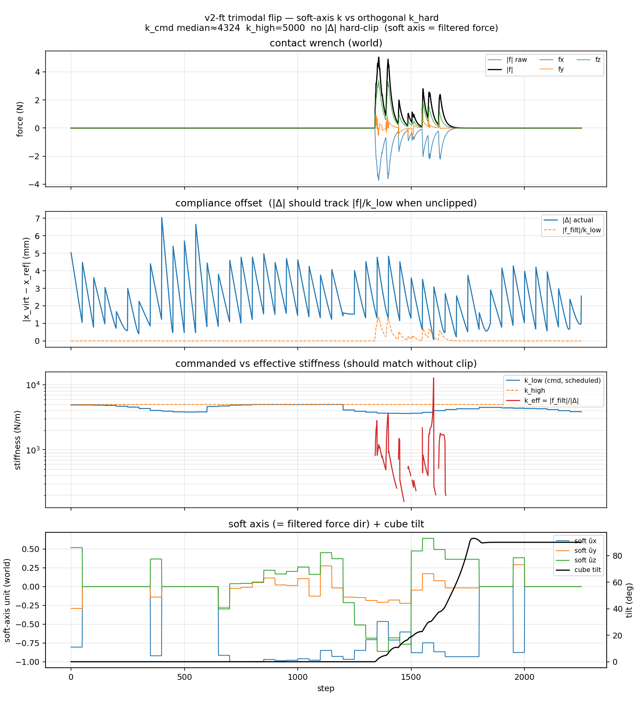

# Demo media（GitHub 展示）

| 文件 | 内容 |
|------|------|
| `sim_flip_v2ft.mp4` / `.gif` | **分屏**：左 MuJoCo（外置机位 + 腕部 RGB）；右实时 ACP 面板（\|f\| / \|Δ\|、**k_soft vs k_hard**、soft-axis û + tilt） |
| `sim_flip_v2ft_stiffness.png` | 同一次录制的**终盘刚度四联图**（读图见下） |
| `sim_flip_v2ft_stiffness_traj.png` | tip / \(x_\text{ref}\) / \(x_\text{virt}\) 轨迹 |
| `virtual_target_stiffness_demo.png` | 阶段一核心算法 Demo 静态图 |

重新生成：

```bash
bash scripts/make_github_media.sh
```

---

## 终盘刚度曲线怎么读（`sim_flip_v2ft_stiffness.png`）



目标：一眼看出 **ACP 是否在「接触方向变软、正交方向保持硬」的同时把方块翻起来**。

### 名词（先扫一眼）

| 词 | 含义 |
|----|------|
| **tip** | 末端工具点（夹爪前方 tip 球中心），控制器跟踪的位置 |
| **tilt** | 方块倾角：`0°` = 立着；≈`90°` = 翻倒在侧面 |
| \(x_\text{ref}\) | 参考位姿（刚性跟踪目标） |
| \(x_\text{virt}\) | 虚拟目标（沿软轴相对参考退让后的目标） |
| \(\Delta = x_\text{virt}-x_\text{ref}\) | 合规偏移；直觉 \(\Delta \approx f / k_\text{soft}\) |
| \(k_\text{low}\) / \(k_\text{soft}\) | **软轴**刚度（接触方向，可变） |
| \(k_\text{high}\) / \(k_\text{hard}\) | **正交方向**高刚度对照（本录屏固定 5000 N/m） |
| soft \(\hat{u}\) | 软轴单位方向（优先 \(x_\text{virt}-x_\text{ref}\)，过小则退回力方向） |
| \(k_\text{eff}=\|f\|/\|\Delta\|\) | 接触段用「力÷退让」估的有效刚度（仅力够大时有意义） |

> v2-ft 闭环主要跟踪策略给出的 \(x_\text{virt}\)；图中 \(k_\text{hard}\) 是 ACP「正交保持硬」的参照线，不是策略另输出的第二个标量。

### 四联图：从上到下

| 子图 | 看什么 | 本录屏典型读法 |
|------|--------|----------------|
| **① 接触力** | 何时真正接触 | 前段 ≈0（空中接近）；约 **1300–1700** 出现尖峰（翻方块接触）；之后回落 |
| **② 合规偏移 \|\Δ\|** | 虚拟目标相对参考让了多少 | 接触段橙虚线 \(\|f\|/k_\text{low}\) 才明显抬起 → 有力才谈「沿力退让」 |
| **③ 刚度对照** | ACP 核心 | 橙虚线 \(k_\text{hard}=5000\) 水平（正交一直硬）；蓝线 \(k_\text{soft}\) 低于硬轴且会动；接触段红线 \(k_\text{eff}\) 更低 → 接触方向更软 |
| **④ soft û + tilt** | 软在哪根轴 + 任务是否成功 | **黑线 tilt：0° → ~90°** = 翻成功；蓝/橙/绿 \(\hat{u}\) 在接触段拧动 = **软轴方向随接触变化** |

**时间对齐口诀**：tilt 开始猛涨的那段 ≈ 力尖峰那段 ≈ 该盯 ③④ 的那段。

### 建议关注的结果指标

| 指标 | 本仓库口径 | 本录屏结论 |
|------|------------|------------|
| **任务成功** | max **tilt ≥ 55°**（展示录屏录到 ~90°） | ✅ 翻倒成功 |
| **接触发生** | 接触段 \(\|f\|\) 明显 > 0 | ✅ 中段有力尖峰 |
| **方向性变刚度** | \(k_\text{soft}\) 相对 \(k_\text{hard}\) 更软；soft \(\hat{u}\) 非零且随接触变化 | ✅ ③④ 可见 |
| **跟踪可行** | tip 跟住 \(x_\text{ref}/x_\text{virt}\)（见 `_traj.png`） | ✅ 轨迹基本重合 |

### 一句话结论

前半空载接近 → 中段接触发力、软轴刚度相对硬轴更软且 soft \(\hat{u}\) 随接触转向 → tip 跟住虚拟目标 → **方块 tilt 拉到约 90°**。  
这就是仿真侧对 ACP「**接触方向自适应变柔顺、正交方向保持刚性**」的直观证据（配合分屏 GIF/MP4 一起看更清楚）。

轨迹附图：[`sim_flip_v2ft_stiffness_traj.png`](sim_flip_v2ft_stiffness_traj.png)（XZ 与时间序列上 tip / ref / virt 重合 → 说明命令跟得住）。
