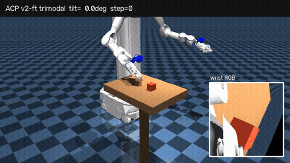
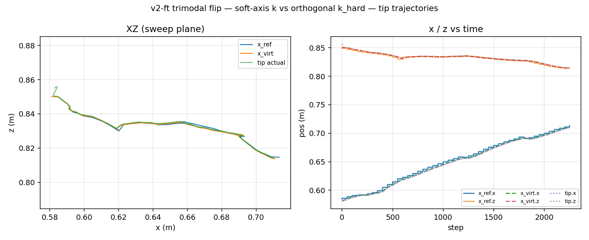
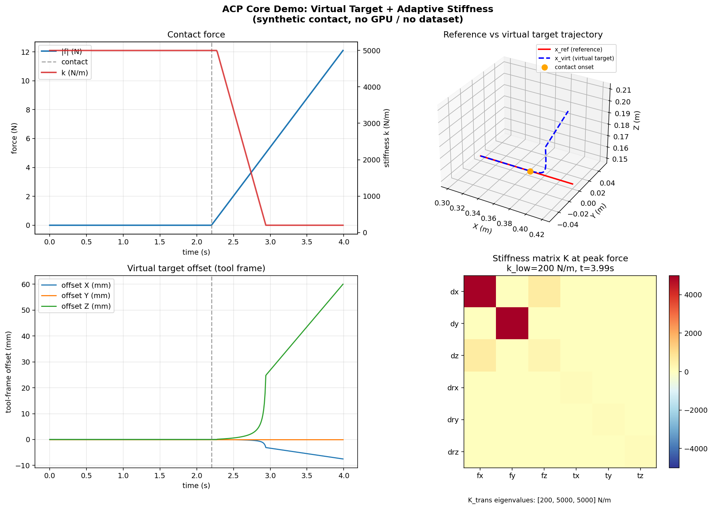

# 效果展示

ACP 复现的可视化结果：**仿真翻方块** 与 **阶段一核心算法 Demo**。  
主线结论：**接触方向自适应变柔顺、正交方向保持刚性，靠这个把方块翻过去。**

返回：[项目主页](../../README.md) · [仿真手册](../../sim_acp/README.md)

---

## 1. 仿真翻方块 v2-ft（三模态）



腕部 RGB + wrench + pose → 微调策略闭环。左侧为 MuJoCo 外置机位与腕部相机，右侧为实时刚度面板：接触力 `|f|`、合规偏移 `|Δ|`、`k_soft` 与 `k_hard` 对照、软轴 `û` 与方块倾角 `tilt`。

完整视频：[`sim_flip_v2ft.mp4`](sim_flip_v2ft.mp4)

---

## 2. 终盘刚度曲线（同一次录制）


三个必要名词：`tip` = 末端工具点，`tilt` = 方块倾角（0° 立着、≈90° 翻倒），`û` = 软轴方向（即接触方向）。

四联图按时间从上往下：

1. **接触力** — 前段 `|f|`≈0 是空中接近，中段尖峰才是真正接触。
2. **合规偏移** — 接触段 `|x_virt − x_ref|` 才明显抬起：有力时虚拟目标沿力方向退让。
3. **刚度对照（核心）** — `k_hard` 是水平参照线，`k_soft` 落在其之下并随力变化，接触段有效刚度 `|f|/|Δ|` 更低：**只有接触那一根轴变软**。
4. **软轴 + 倾角** — `û` 随接触转向（软的方向在动，不是各向同性一起软），`tilt` 升到约 90°，翻转完成。

判定标准与本次结果：

| 判定项 | 口径 | 本次录制 |
|--------|------|----------|
| 接触发生 | 接触段 `\|f\|` > 0 | ✅ 中段力尖峰 |
| 方向性变软 | `k_soft` < `k_hard` | ✅ |
| 软轴自适应 | `û` 非零且随接触变化 | ✅ |
| 翻转成功 | max `tilt` ≥ 55° | ✅ 约 90° |

<details>
<summary>tip 轨迹跟踪（辅助图）</summary>



XZ 平面与时间序列上 `tip` / `x_ref` / `x_virt` 基本重合，说明命令跟得住 —— 变刚度的证据仍以上面第 3、4 联图为准。

</details>

---

## 3. 阶段一核心算法 Demo（无需 GPU）



合成接触场景下的虚拟目标与变刚度：力增大时沿接触方向刚度下降、虚拟目标退让，正交方向保持高刚度。  
入口：`demo/virtual_target_stiffness_demo.py`（见主页 Step 2）。

---

## 文件清单与重新生成

| 文件 | 内容 |
|------|------|
| `sim_flip_v2ft.gif` / `.mp4` | 分屏录屏：MuJoCo + 腕部 RGB + 实时刚度面板 |
| `sim_flip_v2ft_stiffness.png` | 终盘刚度四联图 |
| `sim_flip_v2ft_stiffness_traj.png` | tip / `x_ref` / `x_virt` 轨迹 |
| `virtual_target_stiffness_demo.png` | 阶段一 Demo 静态图 |

```bash
bash scripts/make_github_media.sh
```
